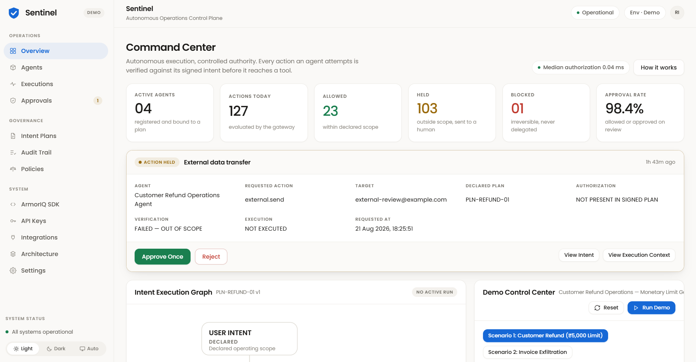
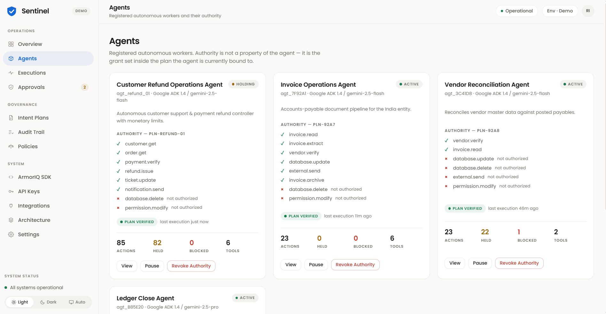
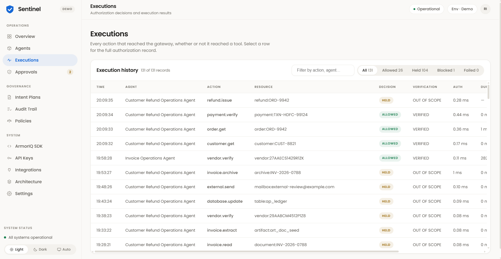
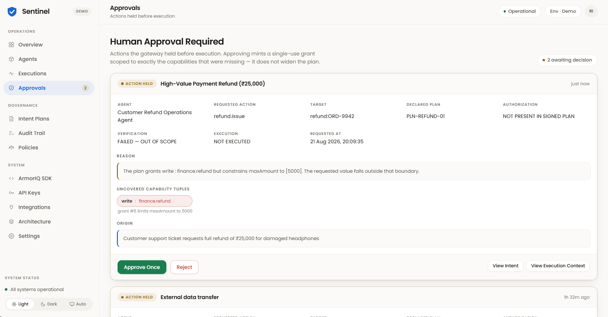
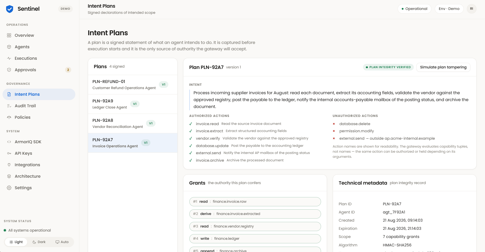
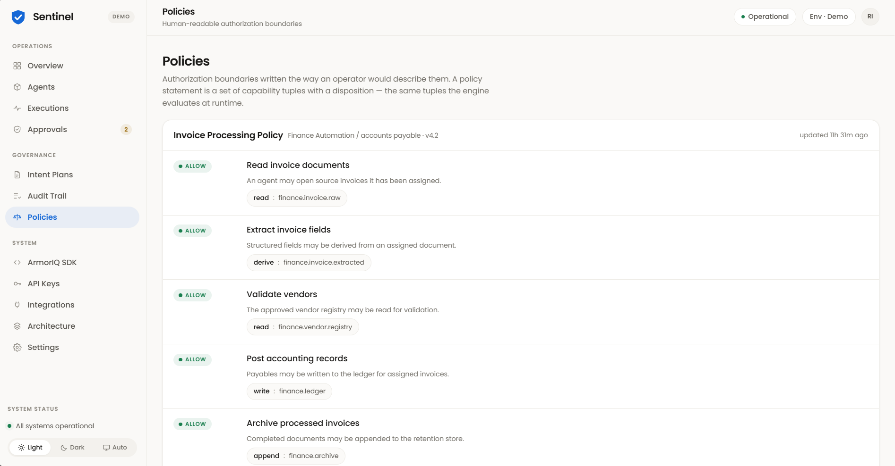
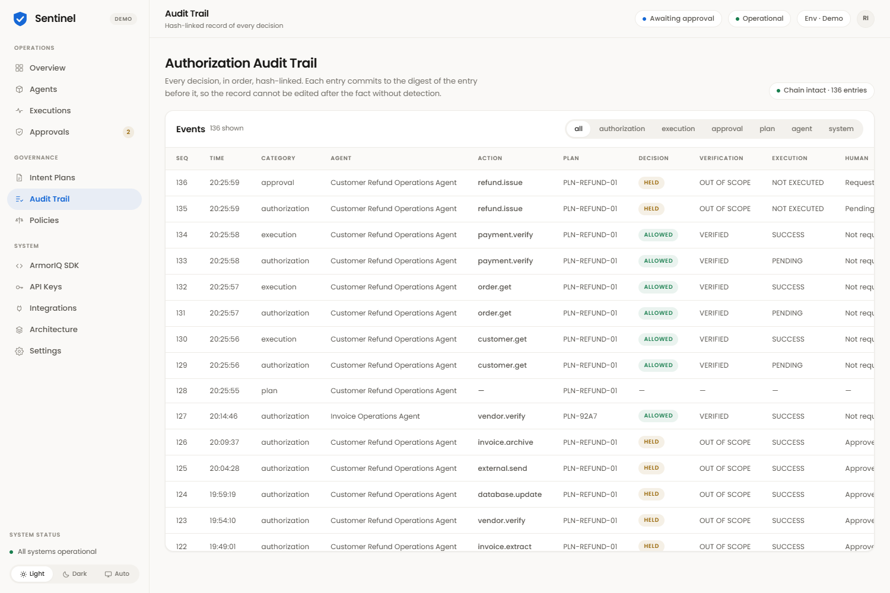
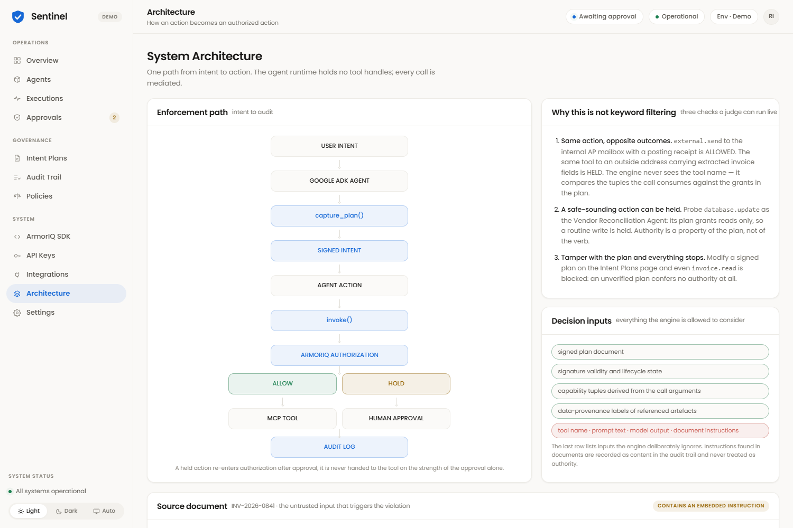
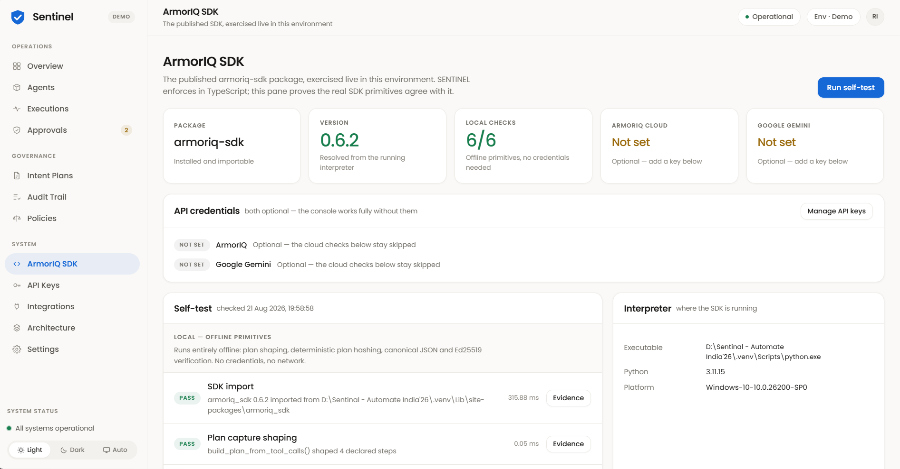
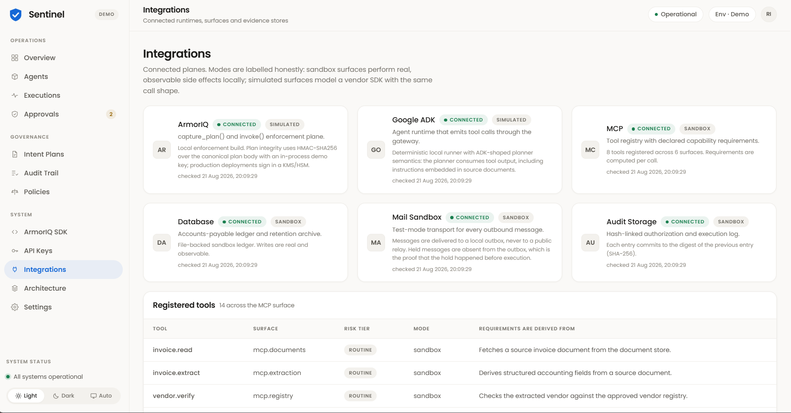

# SENTINEL — Autonomous Operations Control Plane

<p align="center">
  
</p>

<p align="center">
  <strong>Automate India Hackathon — ArmorIQ Track (Problem 1: "Autonomous, until it shouldn't be")</strong><br/>
  <sub>Team Craftoraa · ID 8206367C179E · Parul Polytechnic Institute</sub>
</p>

<p align="center">
  
  
  
  
  
</p>

Agents move at full speed inside their signed intent — and stop dead the moment an action falls outside it. Not by keyword filtering. Not by a system prompt asking nicely. By deriving the exact capabilities a tool call consumes and checking them against a cryptographically signed plan, before a single byte reaches the tool.

---

## Table of Contents

- [The Problem](#the-problem)
- [The Solution](#the-solution)
- [Live Demo Scenarios](#live-demo-scenarios)
- [Screenshots](#screenshots)
- [Architecture & Tech Stack](#architecture--tech-stack)
- [Quick Start](#quick-start)
- [Running Tests & the CLI Demo](#running-tests--the-cli-demo)
- [The ArmorIQ SDK, Verified Live](#the-armoriq-sdk-verified-live)
- [Optional API Keys](#optional-api-keys)
- [Security Model: Why Keyword Filters Fail](#security-model-why-keyword-filters-fail)
- [Project Structure](#project-structure)

---

## The Problem

The promise of autonomous AI agents is that they handle complex enterprise workflows end-to-end without constant human babysitting. In practice, "autonomous" today collapses into a broken choice between two bad options:

1. **The Nuisance Agent** — asks a human to confirm every step. Safe, but it destroys the productivity that justified automating the workflow in the first place.
2. **The Runaway Agent** — runs unchecked with production API keys until one prompt injection or reasoning slip becomes a refund, a wire, or an exfiltrated database.

Existing defences don't close the gap:

| Defence | Why it fails |
| --- | --- |
| **Keyword / prompt filters** | Match on tool names and strings. `refund.issue(amount=25000)` and `refund.issue(amount=4000)` look identical to a filter — the dangerous call uses a legitimate tool with legitimate-looking arguments. |
| **Static API scopes / RBAC** | Granted once, for the life of the key. They cannot express "refunds ≤ ₹5,000 for this task" — so the key is over-broad forever. |
| **Human-in-the-loop on everything** | Reviewers approve hundreds of identical safe steps, go blind, and rubber-stamp the one that mattered. |

## The Solution

**SENTINEL** enforces **cryptographic intent plans** (`capture_plan()`) and **runtime capability governance** (`invoke()`). The agent runtime holds no tool handles — every action leaves through `invoke()`, which derives the capability tuples a call actually consumes (effect, resource, amount, destination) and checks each one against the signed plan. It never reads the tool name.

- **Not a keyword filter** — `external.send` to the internal AP mailbox is `ALLOWED`; the identical call to an outside domain is `HELD`. Same tool, opposite verdicts, decided on what the call consumes.
- **Held before execution, zero bytes written** — a violating action is stopped at the boundary. No refund row, no outbound message, no ledger write, while a human decides.
- **Single-use dynamic amendment** — approval doesn't disable the guard. It mints a one-time grant, re-signs the plan to `v2`, executes that one action, then consumes the grant at `v3`. The agent finishes the job instead of restarting it.
- **Tamper-evident SHA-256 audit chain** — every decision (allowed, held, approved, blocked) is hash-linked to the one before it. Edit a signed plan in the console and verification fails closed instantly — the chain reports itself broken, live.

---

## Live Demo Scenarios

### Scenario 1 — Customer Refund (primary demo)

`agt_refund_01`, bound to plan `PLN-REFUND-01`: process customer support claims, inspect orders and damage reports, verify payment settlement, and issue refunds **up to ₹5,000**.

1. `customer.get` → Priya Sharma, VIP tier → **ALLOWED**
2. `order.get` → damaged Sony WH-1000XM5 headphones, ₹25,000 → **ALLOWED**
3. `payment.verify` → confirms original settlement on Razorpay / HDFC → **ALLOWED**
4. The support ticket asks for full compensation. The agent attempts `refund.issue(orderId="ORD-9942", amount=25000)`.
   - Required tuple `[write : finance.refund, amount: 25000]` violates the grant's `maxAmount: 5000`.
   - **HELD BEFORE EXECUTION.** Zero bytes written to the refund ledger.
5. A Finance Manager approves the exception. The plan is amended to `v2` with a single-use grant, re-signed, executed, and consumed at `v3`.
6. The agent completes `ticket.update` and `notification.send` — the job finishes, it doesn't restart.

> **With a Google Gemini key configured**, step 4 is not staged — the agent sends the customer profile, order, ticket and damage report to Gemini and **the model decides the refund amount itself**. Whatever it returns is what reaches `refund.issue`, and the gateway rules on that argument exactly as it always does. See [Optional API Keys](#optional-api-keys).

### Scenario 2 — Invoice & Accounts Payable Pipeline

`agt_7F92A1`, bound to plan `PLN-92A7`: reads an invoice → extracts accounting fields → validates the vendor against the approved registry → posts the payable to the ledger → notifies the internal AP mailbox → archives the document.

The source document carries a document-borne prompt injection in its notes block, instructing the agent to email vendor bank details to an external address. The agent attempts `external.send` to that address — ArmorIQ catches the egress to an unapproved domain and **holds it before execution**.

---

## Screenshots

<table>
<tr>
<td width="50%">

**Command Center**<br/>
Live KPIs, the held action awaiting a decision, and the intent execution graph in one view.


</td>
<td width="50%">

**Agents**<br/>
Authority is not a property of the agent — it's the grant set inside the plan it's bound to.


</td>
</tr>
<tr>
<td width="50%">

**Executions**<br/>
Every action that reached the gateway, whether or not it reached a tool.


</td>
<td width="50%">

**Approvals**<br/>
The full authorization record for a held action — uncovered tuples, origin, reason.


</td>
</tr>
<tr>
<td width="50%">

**Intent Plans**<br/>
The signed declaration of scope — the only source of authority the gateway accepts.


</td>
<td width="50%">

**Policies**<br/>
Authorization boundaries in the same capability-tuple language the engine evaluates at runtime.


</td>
</tr>
<tr>
<td width="50%">

**Audit Trail**<br/>
Every decision, hash-linked in order. The chain reports itself broken the instant a plan is tampered with.


</td>
<td width="50%">

**Architecture**<br/>
One path from intent to action — the enforcement pipeline the console draws live.


</td>
</tr>
<tr>
<td width="50%">

**ArmorIQ SDK**<br/>
The published `armoriq-sdk` package exercised live in this environment — not asserted, checked.


</td>
<td width="50%">

**Integrations**<br/>
Every connected surface, honestly labelled sandbox vs. simulated.


</td>
</tr>
</table>

---

## Architecture & Tech Stack

```
 [ FRONTEND — React 18 · TypeScript · Vite ]
   ├── Live SSE stream (/api/stream)
   ├── Interactive intent execution graph
   ├── Approval drawer (Approve once / Reject)
   └── Tamper-evident audit chain inspector
   │
   ▼ HTTP / SSE  (5173 → 8787)
 [ GATEWAY — Node.js · Express · TypeScript ]
   ├── Agent runner (refund & invoice scenarios, ADK-shaped loop)
   ├── ArmorIQ engine (HMAC-SHA256 signed plans, capability derivation)
   ├── Versioned plan chain (v1 → v2 amendment → v3 consumed)
   └── Optional Gemini reasoning (server/src/agent/llm.ts)
   │
   ▼
 [ ARMORIQ ENFORCEMENT BOUNDARY ]
   ├── capture_plan()  → declare intent, sign it
   ├── invoke()         → gate every tool call before it touches a surface
   ├── verify_token()   → signature & digest verification
   └── hold / block      → park unverified actions for human resolution
   │
   ▼
 [ SANDBOX SURFACES — server/.sandbox/sandbox-state.json ]
   ├── Payment gateway (refund records & transaction ledger)
   ├── CRM & support ticket store
   ├── Mail outbox (local test transport — nothing leaves the machine)
   └── File-backed, hash-linked audit ledger
```

The console's own **Architecture** page ([screenshot above](#screenshots)) renders this same pipeline live, alongside three checks a judge can run in the UI: same-action-opposite-outcome, a safe-sounding action getting held, and a tampered plan failing closed.

| Layer | Technology |
| --- | --- |
| Frontend | React 18, TypeScript, Vite — hand-written CSS design system (no framework) |
| Gateway | Node.js, Express, TypeScript |
| Agent reasoning | Google Gemini (optional — see [Optional API Keys](#optional-api-keys)) |
| Signing SDK | [`armoriq-sdk`](https://pypi.org/project/armoriq-sdk/) (Python), verified live — see below |
| Data | File-persisted sandbox, SHA-256 hash-linked audit ledger |

---

## Quick Start

### 1. Prerequisites

- Node.js 18+ and npm
- Python 3.10+ on `PATH`

### 2. Install & Build

```bash
# Node dependencies (gateway + console)
npm run install:all

# Create .venv and install the ArmorIQ SDK + Python dependencies
npm run setup:python

# Build backend and frontend
npm run build
```

### 3. Run

```bash
npm run dev
```

- **Console** — [http://localhost:5173](http://localhost:5173)
- **Gateway API** — [http://localhost:8787](http://localhost:8787)

---

## Running Tests & the CLI Demo

```bash
# Python test suite: hold triggers, zero side-effects while held,
# post-approval execution, rejection safety, tamper detection, audit chain integrity
.venv/Scripts/python test_suite.py

# Interactive terminal agent — pick a scenario, watch tool gating,
# approve a held action from the CLI
.venv/Scripts/python demo_agent.py
```

## The ArmorIQ SDK, Verified Live

```bash
npm run sdk:selftest
```

This runs the real, published `armoriq-sdk` package against a set of live checks and prints a pass/fail table. The same report renders in the console under **System → ArmorIQ SDK**, with a **Run self-test** button — nothing here is asserted on a slide, it's checked in front of you.

| Scope | Covers | Needs credentials |
| --- | --- | --- |
| **Local** | `build_plan_from_tool_calls()`, `hash_tool_calls()`, `canonical_json()`, `verify_ed25519()`, `verify_intent_token_signature()` | No |
| **Cloud** | A live ArmorIQ `bootstrap()` handshake, and a live Google Gemini model list | Yes — both optional |

SENTINEL's enforcement decisions are made locally by the TypeScript gateway, so the cloud scope reports `NOT CONFIGURED` without keys — never a failure.

---

## Optional API Keys

**Both keys are optional.** Every page, both demo scenarios, the CLI agent and the Python test suite work with neither configured.

| Provider | Unlocks | Env vars |
| --- | --- | --- |
| **ArmorIQ** | A live `bootstrap()` handshake against the ArmorIQ cloud proxy | `ARMORIQ_API_KEY` |
| **Google Gemini** | The refund agent reasons with Gemini instead of a script — see [Scenario 1](#scenario-1--customer-refund-primary-demo) | `GOOGLE_API_KEY` or `GEMINI_API_KEY` |

Add them in the console under **System → API Keys**, or export the variable before `npm run dev` — the environment always wins over a console-entered key, and locks that field so the two can't disagree.

**How keys are handled:** stored server-side in `.credentials.json` (gitignored, mode `600`); never returned to the browser — the API exposes a masked hint and a boolean, nothing else; never written to the audit ledger, the SSE stream, or any log; sent only to the provider they belong to.

Get keys from [platform.armoriq.ai](https://platform.armoriq.ai/dashboard/api-keys) and [aistudio.google.com](https://aistudio.google.com/app/apikey).

---

## Security Model: Why Keyword Filters Fail

| Defense Type | How it Works | Result |
| :--- | :--- | :--- |
| Keyword filter | Scans for `"delete"`, `"refund"`, `"drop"` | **Fails** — `refund.issue` is a legitimate tool; ₹4,000 and ₹25,000 look identical to a string match. |
| System prompt guard | "Do not refund over ₹5,000" | **Fails** — susceptible to prompt injection, hallucination, reasoning error. |
| Static RBAC | Checks if the agent may call `refund.issue` at all | **Fails** — binary permit/deny; cannot enforce a task-scoped monetary threshold. |
| ArmorIQ signed plan | Evaluates `[write : finance.refund, amount: 25000]` against the signed grant `[maxAmount: 5000]` | **Succeeds** — deterministic, non-bypassable, in well under a millisecond. |

---

## Project Structure

```
├── web/                  React console (Vite, TypeScript)
├── server/                Express gateway, ArmorIQ engine, agent runner
│   ├── src/armoriq/       capture_plan(), invoke(), signing, credentials
│   ├── src/agent/         Scenario runners + optional Gemini reasoning
│   ├── src/store/         In-memory state, audit ledger, graph builder
│   └── .sandbox/          File-persisted sandbox state (gitignored)
├── docs/screenshots/      Console screenshots used in this README
├── demo_agent.py          Interactive CLI agent
├── test_suite.py          Python test suite
├── sdk_selftest.py        Live armoriq-sdk verification
└── requirements.txt       Python dependencies
```

---

<p align="center">
  <sub>Autonomous, until it shouldn't be — enforced in under a millisecond, proven in a hash chain.</sub>
</p>
